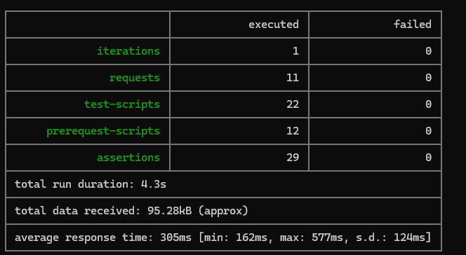

# Trello API Automation Project 🚀

## [English] Project Overview

This repository contains an automated End-to-End (E2E) testing suite for the **Trello REST API**. It demonstrates practical Postman skills, including chained requests, dynamic variables, and automated verification scripts written in JavaScript.

**Key Features:**

- **E2E Workflow:** Automatically creates a Board -> List -> Card -> Updates Card -> Deletes Board.
- **Clean Code:** Tests are written in modern JavaScript (ES6) following BDD style assertions.
- **Dynamic Data:** Uses `pm.collectionVariables` to pass IDs (BoardID, ListID) between requests automatically.
- **Safety Checks:** Scripts verify data integrity (e.g., checking if arrays are not empty) before performing iterations.
- **Negative Testing:** Includes verification of error handling (401 Unauthorized, 404 Not Found).

### 🛠 Tech Stack

- **Postman** - API Development & Testing
- **JavaScript** - Test scripting
- **Newman** - Command-line collection runner
- **Git** - Version control

### 🚀 How to Run

1.  Clone the repository.
2.  Import the `.json` collection file into Postman.
3.  Set up your Trello API credentials in the Collection Variables:
    - `key`: Your Trello API Key
    - `token`: Your Trello API Token
    - `BaseUrlTrello`: `https://api.trello.com/1`
4.  Run the collection using Postman Runner.

> **Note:** The goal of this project is to demonstrate practical API testing skills required for a Junior QA role.

---

## [Polski] Opis projektu

To repozytorium zawiera zestaw automatycznych testów End-to-End (E2E) dla **REST API Trello**. Projekt prezentuje praktyczne umiejętności w zakresie automatyzacji testów API z wykorzystaniem narzędzia Postman oraz języka JavaScript.

**Główne funkcjonalności:**

- **Scenariusz E2E:** Automatyzacja pełnego procesu biznesowego: Utworzenie Tablicy -> Dodanie Listy -> Dodanie Karty -> Edycja Karty -> Usunięcie Tablicy.
- **Czysty kod:** Testy napisane w nowoczesnym JavaScript (ES6) z użyciem czytelnych asercji (styl BDD).
- **Dynamiczne dane:** Wykorzystanie zmiennych kolekcji do automatycznego przekazywania ID (BoardID, ListID) pomiędzy kolejnymi zapytaniami.
- **Weryfikacja danych:** Skrypty zawierają mechanizmy "Safety Checks", które sprawdzają poprawność struktury odpowiedzi przed wykonaniem testów właściwych.
- **Testy negatywne:** Weryfikacja obsługi błędów przez API (np. kody 401 Unauthorized, 404 Not Found).

### 🛠 Technologie

- **Postman** - Projektowanie i testowanie API
- **JavaScript** - Tworzenie skryptów testowych i asercji
- **Newman** - Uruchamianie kolekcji z wiersza poleceń (CLI)
- **Git** - System kontroli wersji

> **Cel:** Celem projektu jest zaprezentowanie praktycznych umiejętności testowania API na poziomie Junior QA.

### 📊 Test Execution Report

Below is the execution report generated by Newman. It confirms that all **29 assertions passed** successfully with **0 failures**.

---

### 📊 Raport z wykonania testów

Poniżej znajduje się raport wygenerowany przez narzędzie Newman. Potwierdza on, że wszystkie **29 asercji przeszło pomyślnie** (0 błędów).

